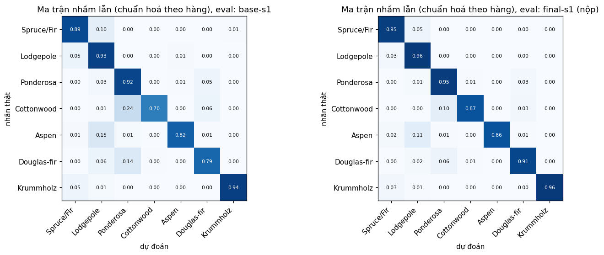

# Báo cáo Lab Day 1 — <Họ tên> — <MSSV>

## 1. Thiết lập

- Môi trường: Google Colab, GPU Tesla T4, PyTorch 2.11.0+cu130. Toàn bộ notebook chạy mất khoảng 25 phút.
- Dữ liệu: Forest CoverType; `train` 464 809 / `eval` 116 203 theo `split_metadata.csv`. Validation: 20% của train (phân tầng, seed 42) → 371 847 train / 92 962 val. Chuẩn hoá 10 cột số bằng thống kê của phần train còn lại. Eval chỉ dùng ở mục 4.
- Model: `M-base` (54→256→128→7, 47 879 tham số, có `assert`). Baseline: cross-entropy, SGD+momentum 0.9, **lr = 0.3** (chọn bằng val), batch 512, 20 epoch, He init, FP32.
- Mốc tham chiếu: accuracy "đoán lớp đa số" trên val = 0.4876 (macro-F1 ≈ 0.094).
- Các chủ đề đã thử: ☑ loss ☑ optimizer ☑ hyper-parameter ☑ dropout ☑ clipping ☑ mixed precision ☑ init (47 lần chạy, mỗi lần một dòng trong `experiments.xlsx`, một ảnh trong `figures/`).
- Quy ước: mọi so sánh dùng **val** (cùng split, 20 epoch, seed 1) và so với ngưỡng nhiễu 2σ ở mục 2. Không có chủ đề nào chạy nhiều hơn một seed ngoài baseline và cấu hình cuối, nên mọi kết luận "A tốt hơn B" ở mục 3 đều là một seed.

## 2. Kiểm tra ban đầu và độ nhiễu

| Kiểm tra | Kết quả |
|---|---|
| Số tham số / shape logits | 47 879 / (B, 7) |
| Loss bước 0 (so với ln 7 = 1.946) | 2.207 (seed 0); 2.269 / 1.978 / 1.901 ở `base-s1/2/3` |
| Quá khớp 20 mẫu: loss cuối | 2.198 → 0.0005 (bước 100) → 0.00016 (bước 500), acc 100% |
| Mọi tham số có gradient khác 0 | có (‖grad‖ từ 0.31 đến 1.95) |
| Baseline, số seed đã chạy | 3 (`base-s1..3`) |
| Baseline: val acc (TB ± σ) | 0.9127 ± 0.0023 |
| Baseline: val macro-F1 (TB ± σ) | 0.8616 ± 0.0032 |

Loss bước 0 lớn hơn ln 7 vì He init cho logits có độ lệch chuẩn ≈ 0.6 (bảng `init`), nên softmax không còn đều; `zeros` và `normal` cho đúng ≈ 1.946. Không phải lỗi code, vì quá khớp 20 mẫu thành công.

**Ngưỡng nhiễu dùng trong báo cáo:** 2σ = **0.0064** (val macro-F1), σ ước lượng từ chỉ 3 seed nên là số thô.

Hình dạng baseline (`figures/base-s1.png`, `figures/compare_baseline.png`): train và val loss còn giảm ở epoch 20, khoảng cách val − train chỉ 0.028, val macro-F1 vẫn tăng (0.61 → 0.86). Tức mô hình **chưa hội tụ, chưa quá khớp**. Lưu ý quan trọng: lr 0.3 nằm ở mép trên của lưới quét {0.003, 0.01, 0.03, 0.1, 0.3} (F1 tăng đơn điệu theo lr, `lr-sgdm-*`, `compare_hparam-lr.png`), nên lr tối ưu có thể lớn hơn; các lần chạy lr 3 và 9 (nhóm clipping) đều sụp, nên tối ưu nằm giữa 0.3 và 3. Đây là hạn chế chính của baseline.

## 3. Kết quả theo chủ đề

### 3.1 Hàm mất mát — CE vs MSE
- Dự đoán: MSE học chậm/kém hơn CE ở cùng lr; tăng lr bù một phần.
- Kết quả (`loss-mse-lr0.3/0.9/3`, `compare_loss.png`): MSE tốt nhất đạt F1 0.7735 (lr 0.3), thấp hơn baseline 0.8616 khoảng 0.088 (≫ 2σ). lr 0.9 còn kém hơn (0.7489), lr 3 sụp về mốc đoán đa số. Phần "tăng lr bù được" **sai**; MSE tốt nhất ở lr thấp nhất đã thử, nên chưa biết lr < 0.3 có tốt hơn không.
- Cơ chế: gradient theo logit của lớp đúng ở bước 0 là ≈ −0.86 với CE (`softmax − y`) nhưng ≈ −0.29 với MSE (`2(z−1)/7`, z ≈ 0). Số đo: `grad_norm` trung vị 0.065 (MSE) so với 0.347 (CE). Không so loss trực tiếp giữa hai hàm; chưa đo F1 từng lớp cho MSE nên không kết luận về lớp hiếm.

### 3.2 Bộ tối ưu hoá
- Dự đoán: Adam/AdamW hơn SGD+momentum; AdamW ≈ Adam; SGD thuần chậm hơn ~10×.
- Lr tốt nhất của mỗi bộ (val macro-F1; `compare_optimizer.png`, `compare_optimizer-lr.png`):

| Bộ tối ưu | exp_id | lr | val macro-F1 | best epoch |
|---|---|---|---|---|
| SGD | `opt-sgd-lr0.9` | 0.9 | 0.8236 | 18 |
| SGD+momentum | `lr-sgdm-0.3` (= `base-s1`) | 0.3 | 0.8599 | 20 |
| Adam | `opt-adam-lr0.003` | 3e-3 | 0.8702 | 19 |
| AdamW (wd 0.01) | `opt-adamw-lr0.003` | 3e-3 | 0.8690 | 18 |

- Adam hơn SGD+momentum 0.0103, lớn hơn 2σ = 0.0064, nhưng **cả hai đều tốt nhất ở mép trên lưới lr** nên chưa kết luận chắc rằng Adam "thắng"; chỉ có thể nói Adam đạt tương đương hoặc nhỉnh hơn với lưới đã thử. AdamW − Adam = −0.0012, trong nhiễu (đúng dự đoán, vì `weight_decay = 0.01` rất nhỏ trong 20 epoch). SGD thuần kém SGD+momentum 0.036; không chứng minh được hệ số 10×.
- Dự đoán "Adam ít nhạy với lr hơn" **không được ủng hộ**: Adam đi từ 0.788 (3e-4) đến 0.870 (3e-3), biên độ cỡ SGD+momentum trên 10× lr (0.820 → 0.860). Adam chậm hơn ~12% mỗi epoch (1.37 s so với 1.22 s).

### 3.3 Hyper-parameter
Xem `compare_hparam.png`, `compare_hparam-lr.png`.
- *lr:* xem mục 2.
- *batch:* `hp-batch2048` (1/4 số bước) kém baseline 0.024 (> 2σ), nhanh 3.8× (0.32 s/epoch), khớp dự đoán. `hp-batch128` **ngược dự đoán**: F1 0.7965 (−0.065) dù có 4× số bước, và chậm 3.9× (4.78 s/epoch). Giải thích phù hợp với số đo nhưng chưa kiểm chứng: cùng lr 0.3 lô nhỏ nhiễu hơn (`grad_norm` trung vị 0.435 so với 0.347), lr tối ưu dịch xuống; cần chạy lại với lr nhỏ hơn. `hp-batch2048-lr4x` (lr 1.2, quy tắc tăng lr theo lô, không khởi động) sụp về mốc đoán đa số: quy tắc không dùng được khi lr gốc đã sát ngưỡng mất ổn định.
- *độ rộng/sâu:* `hp-wide` +0.0133 so với baseline (> 2σ), khớp dự đoán mô hình đang thiếu khớp. `hp-deep` −0.018, **ngược dự đoán**; có thể lr 0.3 quá lớn cho mạng sâu hơn nhưng chưa thử lr khác (một seed).

### 3.4 Dropout
- Dự đoán: không giúp vì mô hình chưa quá khớp; q càng lớn càng hại.
- Kết quả (`drop-0.1/0.3/0.5`, `compare_dropout.png`): val macro-F1 0.8411 / 0.7751 / 0.6548, đều dưới ngưỡng nhiễu so với 0.8616. Khoảng cách val − train loss thu hẹp (0.028 → 0.013 → 0.004 → 0.003) nhưng val loss tăng (0.226 → 0.240 → 0.314 → 0.419). Dropout làm thiếu khớp nặng hơn; chỉ có ích khi có quá khớp rõ, mà ở đây best epoch = 20 cho thấy mô hình vẫn đang học.

### 3.5 Gradient clipping
- `grad_norm` baseline: trung vị 0.347, p95 0.428, max 2.84 → chọn c = 0.35 (cắt khoảng một nửa số bước).
- Ở lr 0.3 (`clip-c0.35-lr0.3`): cắt 66% số bước, F1 0.8523, thấp hơn trung bình baseline 0.0093 (hơi vượt 2σ): clip giảm bước hiệu dụng, không giúp; khớp dự đoán.
- Phản chứng (`compare_clipping.png`): ở lr 3 và 9 **không clip** mạng sụp (`grad_norm` max 7 880 và 966), sau đó dừng ở mốc đoán đa số (val loss 1.209 ≈ entropy phân phối lớp 1.205, F1 0.0936; cờ `diverged` vẫn `N` vì loss không NaN; nhiều khả năng ReLU chết, chưa kiểm tra trực tiếp). **Clip chỉ cứu một phần ở lr 3** (F1 0.192) và **không cứu được ở lr 9** (F1 0.076, val loss dao động). Vậy dự đoán "clip cứu được huấn luyện" chỉ đúng một phần: cả hai lr quá lớn; chưa thử lr trung gian (~1).

### 3.6 Mixed precision
Xem `compare_amp.png`.

| | FP32 | FP16 | BF16 |
|---|---|---|---|
| M-base: thời gian/epoch (s) | 1.22 | 1.73 (+42%) | 1.50 (+23%) |
| M-base: peak mem (MB) | 175 | 180 | 180 |
| M-base: val macro-F1 | 0.8599 | 0.8555 | 0.8519 |
| M-wide: thời gian/epoch (s) | 1.24 | 1.71 (+38%) | 1.49 (+20%) |
| M-wide: val macro-F1 | 0.8749 | 0.8708 | 0.8672 |

Mixed precision **không nhanh hơn** trên mạng và dữ liệu này (khớp dự đoán). Cơ chế (chưa profile): mạng 48k tham số, batch 512, nên thời gian bị chi phối bởi chi phí gọi kernel chứ không phải FLOPs; autocast thêm phép ép kiểu và GradScaler thêm bước unscale/kiểm tra inf mỗi bước. Bộ nhớ không giảm vì dữ liệu nằm sẵn trên GPU. Độ chính xác thấp hơn FP32 0.004 đến 0.010, ở cỡ nhiễu (một seed). T4 không có BF16 native nên BF16 chậm hơn FP16 không đáng ngạc nhiên về mặt phần cứng; chưa kiểm chứng bằng profile. Tham số vẫn FP32; FP16 cần GradScaler vì khoảng biểu diễn hẹp (gradient nhỏ dễ underflow), BF16 có khoảng như FP32 nên thường không cần.

### 3.7 Khởi tạo tham số
`compare_init.png`; độ lệch chuẩn kích hoạt sau mỗi Linear ở bước 0:

| init | loss bước 0 | std L1 | std L2 | std logits | val macro-F1 |
|---|---|---|---|---|---|
| he (`base-s1`) | 2.269 | 0.666 | 0.646 | 0.593 | 0.8599 |
| zeros | 1.946 | 0 | 0 | 0 | 0.0936 |
| normal (std 0.01) | 1.946 | 0.035 | 0.0038 | 0.0003 | 0.8640 |
| xavier | 2.022 | 0.278 | 0.220 | 0.197 | 0.8541 |
| default (`nn.Linear`) | 1.983 | 0.275 | 0.114 | 0.059 | 0.8613 |

- `zeros` đúng dự đoán: mạng không học (acc 0.4876, F1 0.0936), `grad_norm` cuối chỉ 0.036. Mọi nơ-ron trong một lớp giống hệt nhau và ReLU(0) = 0 nên gradient về W1, W2, W3 bằng 0; chỉ bias lớp ra học tần suất lớp.
- `normal` **ngược dự đoán**: kích hoạt co về gần 0 qua các lớp nhưng F1 vẫn ngang He, vì lr 0.3 cùng momentum đủ lớn để thoát nhanh vùng gradient nhỏ. `xavier` (−0.0075) và `default` ở cỡ nhiễu. Với mạng 3 lớp và lr lớn, cách khởi tạo không tạo khác biệt có ý nghĩa ngoài `zeros`; hiện tượng như biểu đồ 30 lớp trong slide chỉ hiện ở mạng sâu hơn nhiều (chưa thử).

## 4. Đánh giá cuối trên tập eval

Số lấy từ `eval_result.json` (final-s1) và `results/eval_<exp_id>.json` (do `scripts/evaluate.py` tạo).

| Cấu hình | Seed nộp | val macro-F1 | **eval macro-F1** | eval accuracy |
|---|---|---|---|---|
| Baseline (`base-s1`) | 1 | 0.8599 | **0.8616** | 0.9108 |
| Cấu hình cuối cùng (`final-s1`) | 1 | 0.9243 | **0.9277** | 0.9530 |

- **Cấu hình cuối** (chọn chỉ bằng val): Adam lr 3e-3, M-wide (512-256), cosine, 40 epoch, batch 512, He init, FP32. Quy trình: lấy bộ tối ưu + lr có val F1 cao nhất trong các lần chạy `M-base` (Adam 3e-3), rồi thử 3 ứng viên chồng dần và chọn theo val. Phân rã trên val, seed 1: SGD+mom 0.8599 → Adam 0.8702 → +M-wide 0.8923 → +cosine 0.9116 → +40 epoch 0.9243. Cấu hình cuối đổi nhiều yếu tố cùng lúc; lợi ích từng yếu tố trong chuỗi chỉ từ một seed và không được chạy theo mọi thứ tự, nên đóng góp riêng chỉ mang tính gợi ý.
- Nhiễu: baseline eval macro-F1 = 0.8617 ± 0.0021, cấu hình cuối 0.9285 ± 0.0009 (3 seed mỗi bên). Cải thiện +0.067 gấp hàng chục lần σ, vượt nhiễu rõ. File nộp là dự đoán của một mô hình (`final-s1`, seed 1); các seed còn lại chỉ để đo nhiễu.
- Val và eval gần nhau: chênh val − eval của `final-s1` là −0.0034 (eval cao hơn), cỡ giá trị nhỏ mà guide nêu (≤ ~0.005); không dùng eval để chọn cấu hình.

### 4.1 Phân tích lỗi theo lớp (`final-s1`, eval)

| Lớp | support | precision | recall | F1 | F1 baseline |
|---|---|---|---|---|---|
| 0 Spruce/Fir | 42 368 | 0.9545 | 0.9465 | 0.9505 | 0.9076 |
| 1 Lodgepole | 56 661 | 0.9558 | 0.9640 | 0.9599 | 0.9248 |
| 2 Ponderosa | 7 151 | 0.9525 | 0.9508 | 0.9516 | 0.9011 |
| 3 Cottonwood | 549 | 0.8879 | 0.8652 | **0.8764** | 0.7868 |
| 4 Aspen | 1 899 | 0.8952 | 0.8636 | **0.8791** | 0.7693 |
| 5 Douglas-fir | 3 473 | 0.9172 | 0.9122 | 0.9147 | 0.8148 |
| 6 Krummholz | 4 102 | 0.9638 | 0.9595 | 0.9616 | 0.9266 |

- Lớp khó nhất là lớp 3 Cottonwood (F1 0.8764, chỉ 0.47% dữ liệu), sát sau là lớp 4 Aspen (0.8791). Cottonwood bị nhầm thành Ponderosa (55/549 = 10.0%) và Douglas-fir (19/549 = 3.5%); Aspen thành Lodgepole (201/1 899 = 10.6%). Cặp nhầm nhiều nhất về số mẫu là Spruce/Fir ↔ Lodgepole (2 108 và 1 737), hai lớp chiếm 85% dữ liệu; Ponderosa ↔ Douglas-fir nhầm đối xứng (194 và 194).
- Lý giải: số mẫu ít (lớp hiếm có ít ví dụ để học ranh giới) và các lớp lẫn nhau vì đặc trưng giống (giả thuyết hợp lý về địa hình/độ cao, **chưa kiểm chứng**). So với baseline, lớp hiếm cải thiện nhiều nhất (+0.09 đến +0.11) so với +0.035 đến +0.05 ở lớp còn lại, nên phần lớn lợi ích của cấu hình cuối đến từ lớp hiếm.
- Sẽ thử: loss có trọng số theo lớp hoặc lấy mẫu lại cho lớp hiếm; huấn luyện lâu hơn (best epoch là 39/40 nhưng cosine đưa lr về 0 nên chưa biết còn giảm không).

## 5. Trả lời các câu hỏi dẫn dắt

1. **Bộ tối ưu nào "thắng" khi mỗi cái được chỉnh lr công bằng?** Ở lr tốt nhất mỗi bộ: Adam 0.8702 ≈ AdamW 0.8690 > SGD+momentum 0.8599 > SGD 0.8236 (`opt-*`, `lr-sgdm-*`). Adam hơn SGD+momentum 0.010 (> 2σ = 0.0064) nhưng cả hai đạt tốt nhất ở mép lưới lr nên kết luận yếu. Khi lr không được chỉnh: nếu chỉ thử một lr nhỏ cho mỗi bộ (Adam 3e-4: 0.788, SGD+momentum 0.003: 0.664) thì Adam "thắng" tới 0.124, gấp hơn 10 lần chênh lệch 0.010 khi mỗi bộ được chỉnh lr, nên kết luận phụ thuộc rất mạnh vào lr được chọn.
2. **Dropout có giúp khi chưa quá khớp?** Không: mọi q đều làm F1 giảm (0.841 / 0.775 / 0.655) vì mô hình đang thiếu khớp (train loss ở eval mode cao, val loss còn giảm). Nên dùng khi val loss bắt đầu tăng trong lúc train loss giảm.
3. **Gradient clipping giải quyết vấn đề gì?** Chặn các bước có gradient cực lớn. Quan sát: ở lr 3 không clip, `grad_norm` max 7 880 và mạng sụp; có clip, max chỉ 3.72 và mạng giữ được một phần (F1 0.192 so với 0.094). Nhưng ở lr 9 clip không đủ (F1 0.076), và ở lr bình thường clip hơi có hại (−0.009). Vậy clipping chống gai gradient, không thay được lr phù hợp.
4. **Mixed precision có nhanh hơn không?** Không: chậm hơn 20% đến 42%, bộ nhớ không giảm (mục 3.6), vì mạng nhỏ bị giới hạn bởi chi phí gọi kernel và autocast/GradScaler thêm việc mỗi bước.
5. **Vì sao khởi tạo toàn 0 hỏng? He khác Xavier thế nào?** Đối xứng + ReLU(0) = 0 nên gradient về mọi trọng số bên dưới lớp ra bằng 0; mạng chỉ học bias lớp ra (F1 0.0936, mốc đoán đa số). He dùng Var = 2/n_in (bù việc ReLU bỏ một nửa phương sai), Xavier dùng 2/(n_in+n_out) (không tính ReLU). Trong thí nghiệm này (3 lớp, lr lớn) He, Xavier, default và cả `normal` đều cùng cỡ nhiễu, nên khác biệt chưa quan trọng ở mạng nông.
6. **Quay lại câu hỏi của bài học (loss không giảm sau 2 000 bước).** Ba phép kiểm tra đầu tiên: (a) *loss bước 0 so với ln 7*: lệch nhiều (như 2.27 ở He hay 1.946 chính xác ở `zeros`) chỉ cho biết khởi tạo/chuẩn hoá, và `zeros` có loss bước 0 "đẹp" nhưng vẫn hỏng nên không đủ một mình; (b) *quá khớp một lô nhỏ (20 mẫu)*: ở đây loss xuống 0.00016 nên code/nhãn/optimizer đúng, nếu không xuống thì lỗi nằm ở vòng huấn luyện hoặc dữ liệu chứ không phải kiến trúc; (c) *in `grad_norm` từng tham số và theo thời gian*: `init-zeros` có `grad_norm` 0.036 (gradient không chảy), `clip-none-lr3` có max 7 880 rồi mạng dừng ở entropy phân phối lớp 1.209 (lr quá lớn). Cả hai trường hợp loss "phẳng" nhưng nguyên nhân ngược nhau, `grad_norm` là phép kiểm tra phân biệt được chúng.

## 6. Hạn chế và điều bất ngờ

- **Kết quả khác dự đoán:** (i) `hp-batch128` thấp hơn baseline dù nhiều bước hơn; (ii) `hp-deep` thấp hơn baseline; (iii) MSE không được cứu bằng lr lớn; (iv) `normal` init ngang He; (v) Adam không ít nhạy lr hơn; (vi) clipping chỉ cứu một phần ở lr 3. Phần lớn có thể liên quan đến việc lr baseline 0.3 ở sát ngưỡng ổn định, nên lr tối ưu khác nhau theo batch/kiến trúc/hàm mất mát; chưa chạy lại với lr riêng cho từng cấu hình.
- **Thiết kế có thể làm kết luận sai:** (a) chỉ một seed cho mọi thí nghiệm ngoài baseline và cấu hình cuối, σ chỉ từ 3 seed; (b) lr baseline và lr tốt nhất của Adam/AdamW nằm ở mép lưới, nên so sánh optimizer và các thí nghiệm "một yếu tố" (batch, deep, loss, clipping) đều lấy lr 0.3 làm điểm tựa có thể bất lợi cho từng cấu hình; (c) batch 128 và 2048 khác số bước cập nhật nên không tách được ảnh hưởng của batch khỏi số bước; (d) cấu hình cuối đổi 4 yếu tố cùng lúc (Adam, M-wide, cosine, số epoch gấp đôi), trái với nguyên tắc cùng 20 epoch của các nhóm trước; (e) các giải thích cơ chế đã gắn nhãn "chưa kiểm chứng" là phỏng đoán, chưa có thí nghiệm đối chứng.
- **Nếu có thêm thời gian:** mở rộng lưới lr (SGD+momentum lên ~1, Adam lên 1e-2), thêm 2 seed cho mọi thí nghiệm một yếu tố, chạy batch 128 với lr nhỏ hơn, thử clipping ở lr khoảng 1, và thử loss có trọng số lớp.

## 7. Phụ lục

- Các file nộp: `REPORT.md`, `experiments.xlsx` (47 dòng), `predictions_eval.csv`, `eval_result.json`, `figures/` (47 ảnh thí nghiệm + 12 ảnh `compare_*`), `results/` (47 file lịch sử + 5 file `eval_<exp_id>.json` (cho 5 lần chạy ngoài `final-s1`)), `code/` (`lab.ipynb`, `data.py`, `model.py`, `optimizer.py`, `train.py`, `plots.py`, `results_table.py`).
- Thời gian chạy: khoảng 25 phút trên T4.
